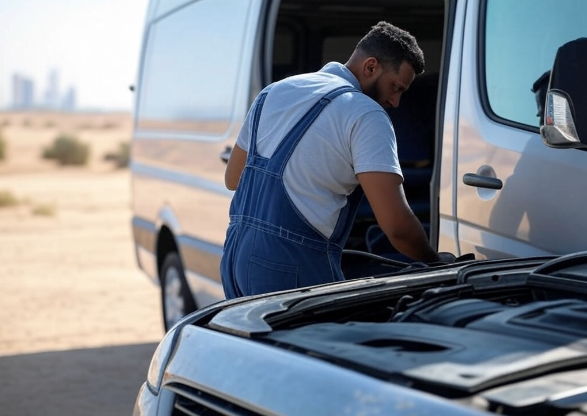

# كراج متنقل في الكويت 2025: خدمة صيانة سيارات 24 ساعة بجودة عالمية

 
  
 
 في ظل التطور المتسارع الذي تشهده الكويت، أصبحت خدمات <a href="https://karajkw.com/" target="_blank">كراج متنقل الكويت</a> من الخيارات الأساسية التي يعتمد عليها السائقون لضمان استمرارية تنقلهم بأمان وسلاسة. مع حلول عام 2025، تبرز هذه الخدمة كحل مبتكر يقدم صيانة سيارات على مدار 24 ساعة، بجودة عالية وسرعة استجابة لا مثيل لها. في هذا المقال، نستعرض تفاصيل هذه الخدمة، أهميتها، وكيف يمكن أن تكون الخيار الأمثل لكل سائق في الكويت. 

## ما هو الكراج المتنقل وكيف يعمل؟

 الكراج المتنقل هو عبارة عن ورشة صيانة جوالة مجهزة بأحدث الأدوات والتقنيات، تصل إلى موقع العميل مباشرة لتقديم خدمات إصلاح وصيانة السيارات. سواء كنت في منطقة السالمية، الفروانية، أو حتى على طريق الدائري السادس، يضمن الكراج المتنقل <a href="https://mobilegaragekuwait.com/" target="_blank">في الكويت</a> وصول فريق متخصص إليك في أي وقت. هذه الخدمة تعتمد على التكنولوجيا الحديثة، حيث يمكن طلبها عبر تطبيقات الهواتف الذكية أو الاتصال المباشر، مما يجعلها خيارًا مثاليًا للحياة العصرية السريعة. 

## لماذا تحتاج إلى كراج متنقل في الكويت 2025؟

### 1. توفر الخدمة على مدار 24 ساعة

الحياة في الكويت لا تهدأ، وكذلك احتياجات السائقين. قد يتعطل محرك سيارتك في ساعة متأخرة من الليل، أو تواجه مشكلة في الإطارات أثناء عطلة نهاية الأسبوع. مع خدمة الكراج المتنقل المتوفرة 24/7، لن تقلق بعد الآن، حيث يصل إليك فريق الصيانة بسرعة فائقة لمعالجة المشكلة.

### 2. تغطية شاملة لجميع مناطق الكويت

من العاصمة إلى الأحمدي، ومن حولي إلى مبارك الكبير، يغطي الكراج المتنقل كافة مناطق الكويت. هذه التغطية الشاملة تضمن وصول الخدمة إليك أينما كنت، دون الحاجة إلى البحث عن ورشة قريبة أو سحب سيارتك لمسافات طويلة.

### 3. خدمات متنوعة تلبي كافة الاحتياجات

يقدم الكراج المتنقل مجموعة واسعة من الخدمات التي تشمل:

<ul style="text-align: right;">
  <li><strong>إصلاح الإطارات:</strong> استبدال الإطارات التالفة أو المثقوبة في الحال.</li>
  <li><strong>صيانة البطاريات:</strong> فحص واستبدال البطاريات بأخرى أصلية مع ضمان.</li>
  <li><strong>إصلاح الأعطال الميكانيكية والكهربائية:</strong> تشخيص دقيق باستخدام أجهزة متطورة.</li>
  <li><strong>تغيير الزيوت والفلاتر:</strong> للحفاظ على أداء المحرك بكفاءة عالية.</li>
  <li><strong>خدمات الطوارئ:</strong> مثل فتح الأبواب المغلقة أو شحن البطارية.</li>
</ul>

### 4. فريق عمل محترف ومدرب

يعتمد الكراج المتنقل على فريق من الفنيين المدربين على أعلى مستوى، والذين يمتلكون خبرة واسعة في التعامل مع مختلف أنواع السيارات، سواء كانت سيارات عائلية، رياضية، أو فاخرة. هذا الاحتراف يضمن تقديم خدمة بجودة عالمية.

### 5. توفير الوقت والجهد

بدلاً من قضاء ساعات في نقل سيارتك إلى ورشة تقليدية والانتظار لإتمام الإصلاحات، يأتي الكراج المتنقل إليك مباشرة، مما يوفر عليك الوقت والجهد ويسمح لك باستكمال يومك دون تأخير.

## كيف يتماشى الكراج المتنقل مع تطلعات الكويت 2025؟

في إطار رؤية الكويت 2035 التي تهدف إلى تحويل البلاد إلى مركز تجاري ومالي عالمي، تساهم الخدمات المبتكرة مثل الكراج المتنقل في تعزيز جودة الحياة ودعم التنمية المستدامة. هذه الخدمة لا تقتصر على إصلاح السيارات فحسب، بل تعكس التزام الكويت بتبني الحلول الذكية التي تواكب متطلبات العصر. بفضل استخدام التكنولوجيا في طلب الخدمة وتنفيذها، يصبح الكراج المتنقل جزءًا من منظومة التحول الرقمي في البلاد.

## كيف تطلب خدمة الكراج المتنقل في الكويت؟

طلب الخدمة أمر في غاية السهولة، ويتطلب بضع خطوات بسيطة:

<ol style="text-align: right;">
  <li><strong>الاتصال أو استخدام التطبيق:</strong> تواصل مع الخدمة عبر رقم مخصص (مثال: 1234-5678) أو من خلال تطبيق مخصص.</li>
  <li><strong>تحديد الموقع والمشكلة:</strong> أخبر الفريق بموقعك الدقيق ووصف المشكلة التي تواجهها.</li>
  <li><strong>انتظر الفريق:</strong> سيصل فريق الصيانة المتنقل خلال دقائق معدودة لتقديم الحل المناسب.</li>
</ol>

## نصائح للحفاظ على سيارتك في الكويت 2025

للتقليل من الأعطال المفاجئة، ينصح باتباع النصائح التالية:

<ul style="text-align: right;">
  <li>قم بفحص الإطارات والبطارية بشكل دوري، خاصة مع ارتفاع درجات الحرارة في الكويت.</li>
  <li>التزم بجدول الصيانة الدورية لتغيير الزيوت والفلاتر.</li>
  <li>احتفظ دائمًا برقم كراج متنقل موثوق لضمان الحصول على مساعدة فورية عند الحاجة.</li>
</ul>

## لماذا يعتبر الكراج المتنقل الخيار الأفضل؟

<ul style="text-align: right;">
  <li><strong>السرعة:</strong> استجابة فورية وخدمة في الموقع دون تأخير.</li>
  <li><strong>الجودة:</strong> استخدام قطع غيار أصلية وأدوات متطورة.</li>
  <li><strong>الراحة:</strong> لا حاجة لنقل السيارة أو الانتظار في الورش التقليدية.</li>
  <li><strong>السعر:</strong> تكاليف تنافسية مع شفافية كاملة في الفوترة.</li>
</ul>

## الخلاصة

في عام 2025، يمثل الكراج المتنقل في الكويت نقلة نوعية في عالم صيانة السيارات، حيث يجمع بين الكفاءة، السرعة، والتوفر المستمر على مدار 24 ساعة. سواء كنت تواجه عطلًا مفاجئًا أو تحتاج إلى صيانة دورية، فإن هذه الخدمة توفر لك الحل الأمثل بجودة عالمية. لا تدع أعطال السيارة تعيق يومك، واختر الكراج المتنقل لتجربة صيانة متميزة تلبي تطلعاتك في الكويت. تواصل مع أقرب كراج متنقل اليوم واستمتع براحة البال أثناء القيادة!

